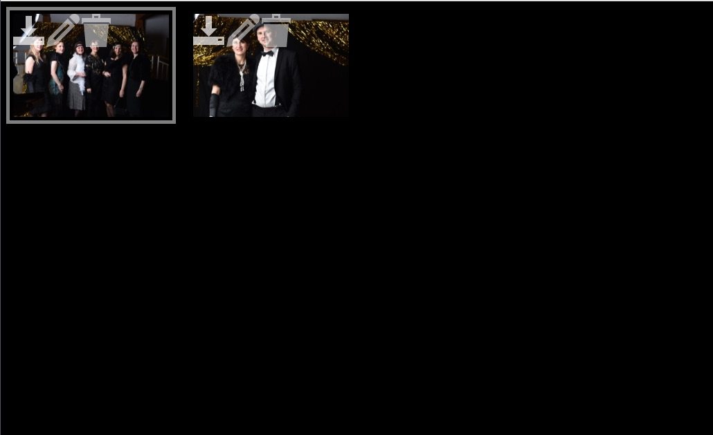

# photobooth

osx only, sorry  
`brew upgrade gphoto2`  
nikon tested only, set camera mode to RAW and small BASIC  
`~/photobooth/binary/gphoto2 --auto-detect`  
`~/photobooth/binary/gphoto2 --set-config capturetarget=1`  
start server
`sudo php -S 0.0.0.0:80 -t ~/photobooth/Server`  
copy everything to ~/photobooth/Server
point your browser to http://localhost
move around with cursor keys, shoot with spacebar

I suggest to link also to editing 
